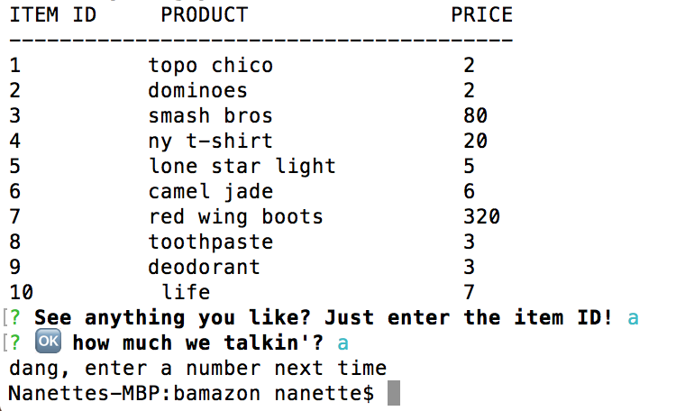
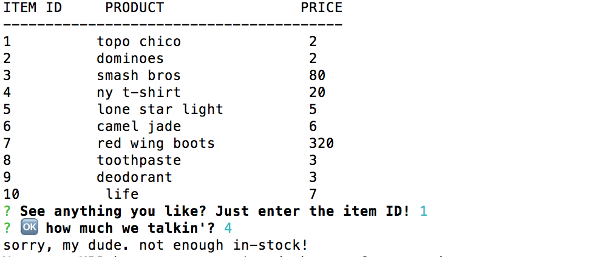
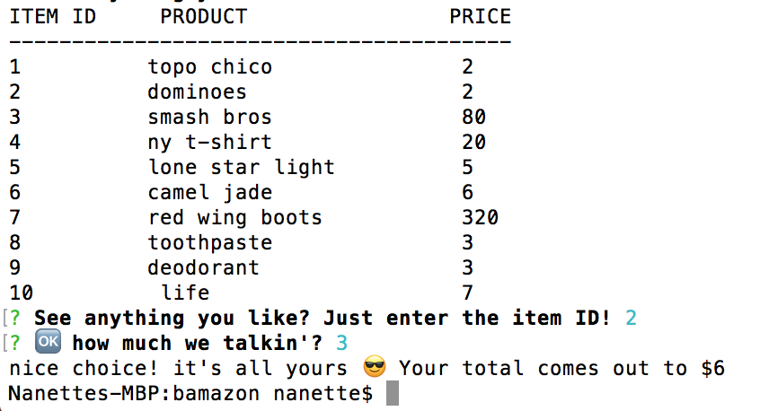

# Bamazon! Kinda sorta like amazon 🤷
link here 🚨👉https://nlabrada.github.io/bamazon/ 👈🚨

## Customer
Check out the items on sale in your terminal! Updates the stock quantity, prompts if stock quantity is invalid/insufficient, provides accurate total.
### Prompt when you enter invalid id input

### Prompt for when there's not enough in stock 😔

### When it all works out!

